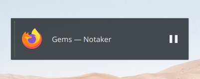
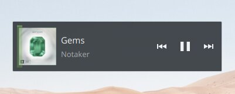
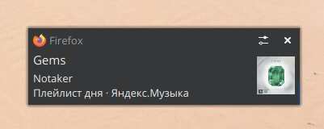

# Интеграция Яндекс.Музыки с MediaSession API

> Этот юзерскрипт интегрирует Яндекс.Музыку с [MediaSession API](https://w3c.github.io/mediasession/), что позволяет браузеру отображать текущий играющий трек в системе и привязывать медиа-клавиши для управления проигрыванием.

**Наглядно**:

|             Без скрипта             |           Со скриптом            |
| :---------------------------------: | :------------------------------: |
|  |  |
| <ul><li>Невозможно полноценно управлять проигрыванием</li><li>Вместо названия трека отображается название страницы</li></ul> | <ul><li>Динамично менающиеся элементы управления проигрыванием</li><li>Отображаемые обложка, исполнитель, заголовок и альбом</li><li>Уведомление о текущем треке</li><li>Перемотка в начало трека клавишей «Назад»</li></ul> |

<em>Пример уведомления.</em>

Кстати, это всё настраивается, просто переходите в настройки Яндекс.Музыки и переключайте нужные опции.

### Это круто, как установить? 🤔

Нужен будет менеджер юзерскриптов — расширение, которое запускает установленные скрипты на нужных сайтах. Вот проверенные: [Tampermonkey](https://www.tampermonkey.net/), [ViolentMonkey](https://violentmonkey.github.io/). **Greasemonkey не поддерживается**.

Установили менеджер? Здорово, нажимайте кнопку — она откроет окно установки скрипта:

Перезагрузите страницу Яндекс.Музыки — если расширение успешно загрузится, вы увидите надпись «Расширение интеграции с MSA установлено».

#### Что-то ещё? 👀

Да, для каждой системы нужно ещё несколько действий:

**Chromium-подобные браузеры**:

Если вы используете любой браузер на движке Chromium (это: Хром, Яндекс.Браузер, Vivaldi или Опера):

1. Наберите в адресной строке `chrome://flags/#hardware-media-key-handling` и нажмите Enter, для подсвеченной опции выберите справа «Enabled»: это включит **медиа-клавиши по всей системе**;
2. В поле «Search flags» сверху введите `global-media-controls` и нажмите Enter, для подсвеченной опции тоже выберите «Enabled»: это включит **показ кнопки управлением проигрыванием на сайтах** в панели расширений ([это что?](https://rozetked.me/news/6775-v-google-chrome-poyavitsya-edinaya-panel-vosproizvedeniya-dlya-vseh-vkladok)).
3. Перезапустите браузер. Наслаждайтесь! 🍹🏖️

**Linux KDE**:

Если вы пользуетесь KDE Linux, установите Plasma Browser Integration, [подробнее тут →](https://vk.com/@kde_ru-plasma-browser-integration-15)

### 🐞 Сообщения об ошибках

Если скрипт будет вести себя неправильно, или у вас есть какие-то пожелания, откройте новую задачу [в секции Issues на GitHub](https://github.com/Sasha-Sorokin/ymusic_msa/issues), предварительно поискав, не открыл ли кто другой похожую.

### 💖 Поддержите автора

Написание подобных скриптов требует времени и сил. Вы можете выразить благодарность одним или несколькими из следующих способов:

- 📢 Рассказав об этом скрипте знакомым
- 😮 Посмотрев другие мои скрипты:
  - [Интеграция ВКонтакте с MediaSession API](https://github.com/Sasha-Sorokin/vkaintegra/blob/master/README.ru.md)
  - [Добавление в списки новостей ВКонтакте](https://github.com/Sasha-Sorokin/vklistadd/blob/master/README.ru.md)
- 💜 Пожертвовав мне пару рублей на [Яндекс.Деньги →](https://money.yandex.ru/to/410014746904198)

Спасибо!
